# ⚗️ ChemoSuite: Multimodal Chemometrics Platform

<p align="right">
  <b>Русский</b> | <a href="README_EN.md">English</a>
</p>

<div align="center">


[](https://nom-spectra.streamlit.app/)

**🌐 Онлайн-демо веб-приложения:** [https://nom-spectra.streamlit.app/](https://nom-spectra.streamlit.app/)

<br />

**Комплексная веб-платформа для глубокого хемометрического анализа природного органического вещества (РОВ/NOM) и техногенного шлам-лигнина.**

<br />

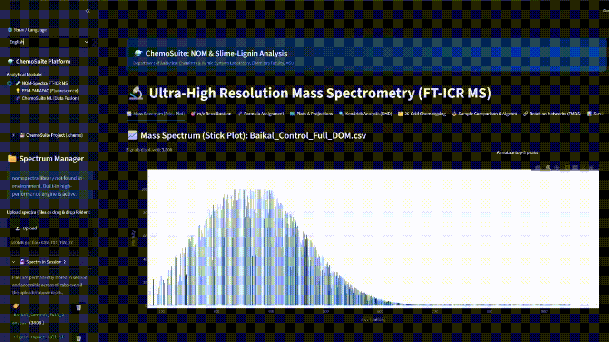

</div>

---

## 📖 О платформе

Исследование сложных полидисперсных природных систем требует параллельного применения ортогональных физико-химических методов. **ChemoSuite** объединяет масс-спектрометрию сверхвысокого разрешения (**FT-ICR MS**), спектрофлуориметрию матриц возбуждения-испускания (**EEM-PARAFAC**), электронную спектрофотометрию поглощения (**UV-Vis**) и алгоритмы мультиблочной интеграции данных (**Low- & Mid-Level Data Fusion + PLS-DA, OPLS-DA, sPLS-DA**) в единый интерактивный веб-интерфейс.

Платформа решает ключевую задачу экологического мониторинга: надежное отделение фонового автохтонного органического вещества природных вод от техногенных отходов переработки древесины (на примере шлам-лигнина БЦБК в экосистеме оз. Байкал).

---

## 🔬 Аналитические модули

| Модуль | Входные данные | Ключевые методы и алгоритмы | Выходные аналитические дескрипторы |
| :--- | :--- | :--- | :--- |
| **🧪 1. FT-ICR MS Studio** | Пик-листы масс-спектров (`.csv`, `.tsv`, `.txt`, `.xy`) или **ZIP-архивы спектров** | Полиномиальная рекалибровка шкалы, векторный перебор брутто-формул с азотным правилом и изотопной $^{13}\text{C}$-фильтрацией, TMDS с **интерактивным молекулярным графом реакций** и топологическими хабами (Reaction Hubs), биогеохимические полигоны Ван-Кревелена, пакетная обработка архивов, спектральная алгебра | $H/C$, $O/C$, $DBE$, $AI$, $NOSC$, биомолекулярные пулы (Липиды, Белки, Лигнин/CRAM, Таннины, CAS), сетка 20 ячеек Перминовой, гомологические ряды KMD, топологические степени узлов $\text{Degree}$ |
| **💡 2. Оптическая спектроскопия (EEM & UV-Vis)** | 2D матрицы EEM (`.csv`, `.dat`, `.txt`) и 1D спектры УФ-Вид (`.csv`, `.txt`) | Интерполяция Делоне для вырезания рэлеевского рассеяния, рамановская нормировка (R.U.), неотрицательный PARAFAC, **CORCONDIA диагностика**, **Сплит-хаф (Split-Half) валидация**, **идентификация по эталонной спектральной библиотеке OpenFluor ($TCC \ge 0.85/0.90$)**, коррекция внутреннего фильтра (IFE), фильтр Савицкого — Голея ($d^1A, d^2A$) | Индексы $FI$, $HIX$, профили и вклады флуорофоров $C_1–C_3$, совпадения OpenFluor ($C_1–C_6$), стабильность модели $TCC$, $A_{254}, A_{280}, E_2/E_3, E_4/E_6, S_R, d^2A_{280}, M_w, \text{SUVA}_{254}$ |
| **🧬 3. ChemoSuite ML** | Объединенные матрицы трех модальностей (сессия или CSV) | **Low-Level Fusion** (блочный скейлинг $1/\sqrt{P_k}$) и **Mid-Level Fusion** (PCA сжатие FT-ICR MS), **PLS-DA, OPLS-DA и Sparse PLS-DA (sPLS-DA с $L_1$-регуляризацией)**, 95% эллипс Хотеллинга ($T^2$), пермутационный тест ($H_0$), S-Plot | Классификация проб, проекции $LV_1/LV_2$, метрики $R^2X, R^2Y, Q^2$, матрица ошибок, $p$-value, ранжированный VIP-score, панель разреженных биомаркеров ($|W|$) и доли вклада блоков ($\text{VIP}^2$) |

---

## 📸 Скриншоты аналитических модулей и визуализации

### Модуль 1: Спектрометрия сверхвысокого разрешения (FT-ICR MS)

#### Диаграмма Ван-Кревелена (Van Krevelen Plot)
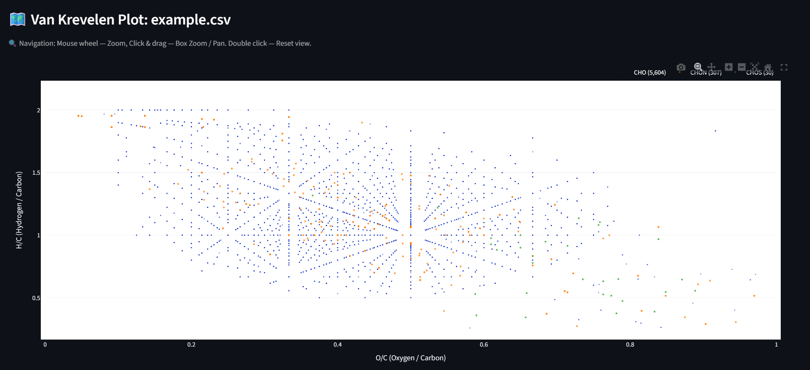

* Молекулярное картирование идентифицированных формул в координатах $H/C$ vs $O/C$ с дифференциацией по пулам гетероатомов ($CHO$, $CHON$, $CHOS$, $CHONS$) и стандартным биогеохимическим классам соединений (Липиды, Пептиды/Белки, Углеводы, Лигнины/Полифенолы/CRAM, Таннины, Конденсированная ароматика CAS, Ненасыщенные УВ) с процентным распределением.

#### Анализ дефекта массы Кендрика (KMD Plot)
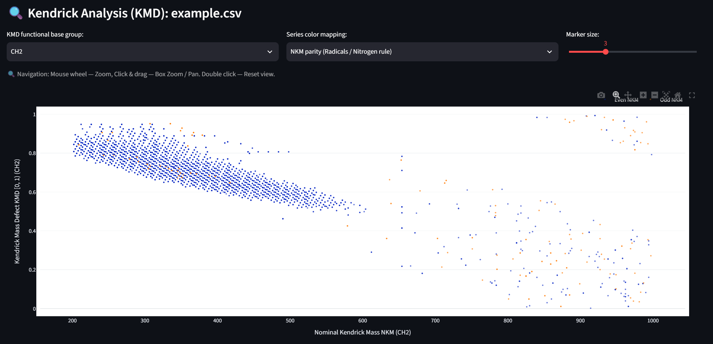

* Выявление гомологических серий по базовой функциональной единице $CH_2$ с цветовой дифференциацией по четности номинальной массы (NKM Parity), разделяющей соединения по правилу азота.

#### Хемотипирование по 20 ячейкам Перминовой (20-Grid Heatmap)
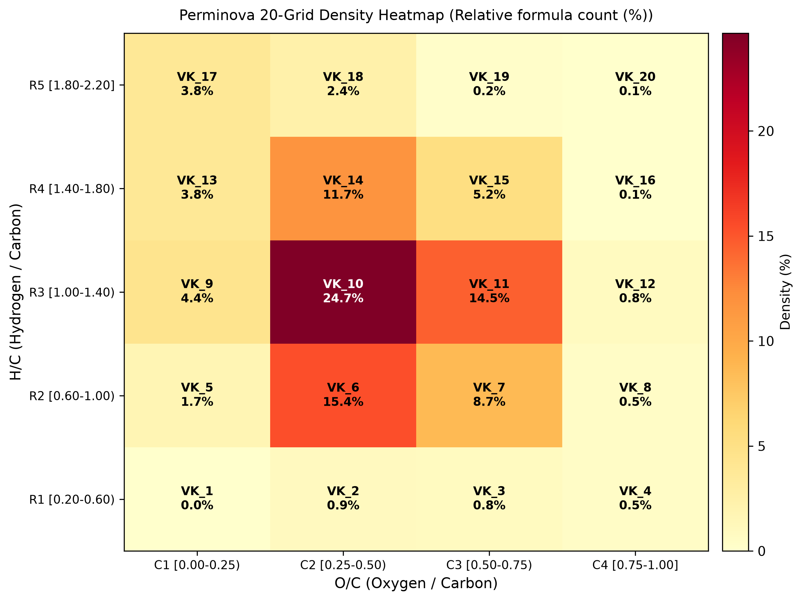

* Оцифровка непрерывного молекулярного пространства диаграммы Ван-Кревелена в дискретный 20-мерный вектор признаков ($VK_1–VK_{20}$) по относительному числу формул и средневзвешенной интенсивности.

#### Интерактивный молекулярный граф реакций (TMDS Network Graph)
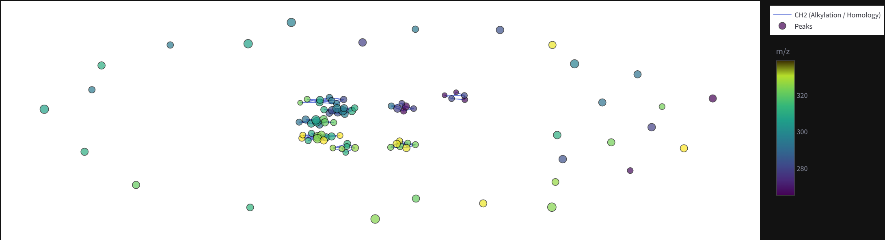

* Топологический сетевой граф взаимопревращений природных и техногенных молекул по дискретным геохимическим векторам ($\text{CH}_2$, $\text{O}$, $\text{H}_2\text{O}$, $\text{CO}_2$, $\text{SO}_3$) с выделением ключевых реакционных хабов (Top Topological Hubs) и расчетом узловых степеней связности ($\text{Degree}$).

---

### Модуль 2: Оптическая спектроскопия (EEM-PARAFAC & UV-Vis)

#### Оптическая контурная карта флуоресценции (EEM Contour Map)
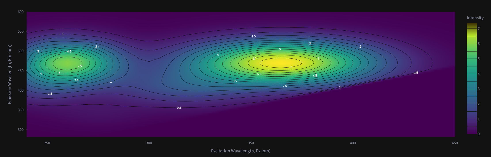

* Интерактивная 2D-визуализация матрицы возбуждения-испускания ($Ex$ 240–450 нм, $Em$ 280–600 нм) в палитре Viridis после автоматического устранения рэлеевского рассеяния 1-го и 2-го порядков с интерполяцией по Делоне.

#### Спектральные профили компонент PARAFAC (Loadings B & C)
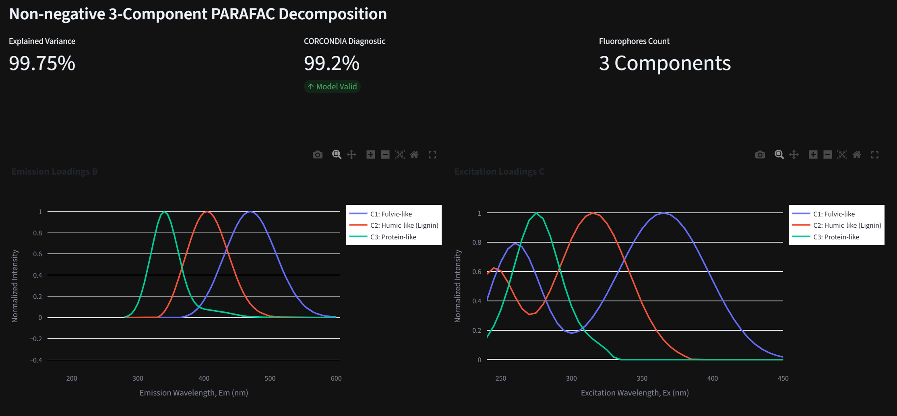

* Декомпозиция трехмерного массива флуоресценции на спектры чистых компонентов: эмиссионные профили (Loading B) и профили возбуждения (Loading C) для фульвоподобного $C_1$, гуминового $C_2$ и белкового $C_3$ флуорофоров с оценкой адекватности по диагностике CORCONDIA.

#### Распределение флуорофоров по сериям проб (Scores Matrix A)
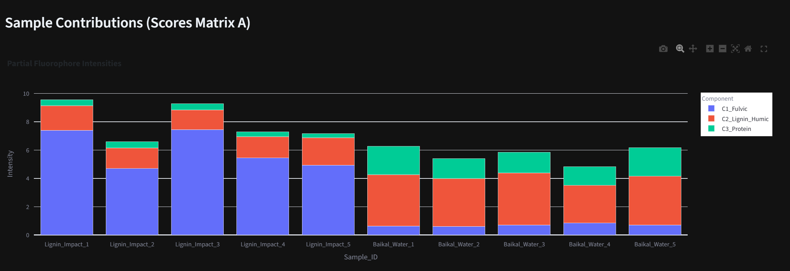

* Сравнительный мониторинг относительных концентрационных вкладов флуорофоров в исследуемых сериях проб, наглядно демонстрирующий преобладание компонентов $C_1$ и $C_2$ в зонах техногенной нагрузки шлам-лигнина.

#### УФ-Вид спектрофотометрия и коррекция эффекта внутреннего фильтра (Экран 4)
* Интерактивный анализ спектров поглощения $A(\lambda)$ с реперными пиками ($A_{254}, A_{280}, A_{365}$).
* Оценка средней молекулярной массы по уравнению Перминовой: $M_w = 3450 - 390 \cdot (E_2/E_3)$.
* Определение лигнинового минимума 2-й производной $d^2A$ при $\sim 280$ нм методом Савицкого — Голея.
* Коррекция эффекта внутреннего фильтра (IFE) матриц флуоресценции: $F_{\text{corr}} = F_{\text{obs}} \cdot 10^{0.5(A_{\text{ex}} + A_{\text{em}})d}$.
* Расчет спектрального наклона $S_{275-295}, S_{350-400}, S_R$ и удельного показателя $\text{SUVA}_{254}$.

---

### Модуль 3: Мультиблочная интеграция и машинное обучение (Data Fusion, PLS-DA & OPLS-DA)

#### Дискриминантный анализ и отбор маркеров (PLS-DA, OPLS-DA & VIP Scores)
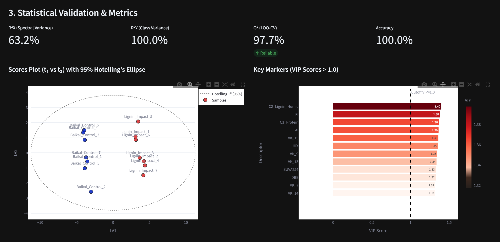

* Мультимодальная классификационная модель на объединенном пуле дескрипторов трех методов (**FT-ICR MS + EEM-PARAFAC + UV-Vis**).
* **Модели PLS-DA и OPLS-DA:** стандартный PLS-DA и ортогональный OPLS-DA (Orthogonal PLS-DA) с разделением предиктивной вариации ($t_{\text{pred}}$) и систематического шума ($t_{\text{ortho}}$).

#### 3D проекция латентных переменных и 95% эллипсоид Хотеллинга (Scores Plot 3D)
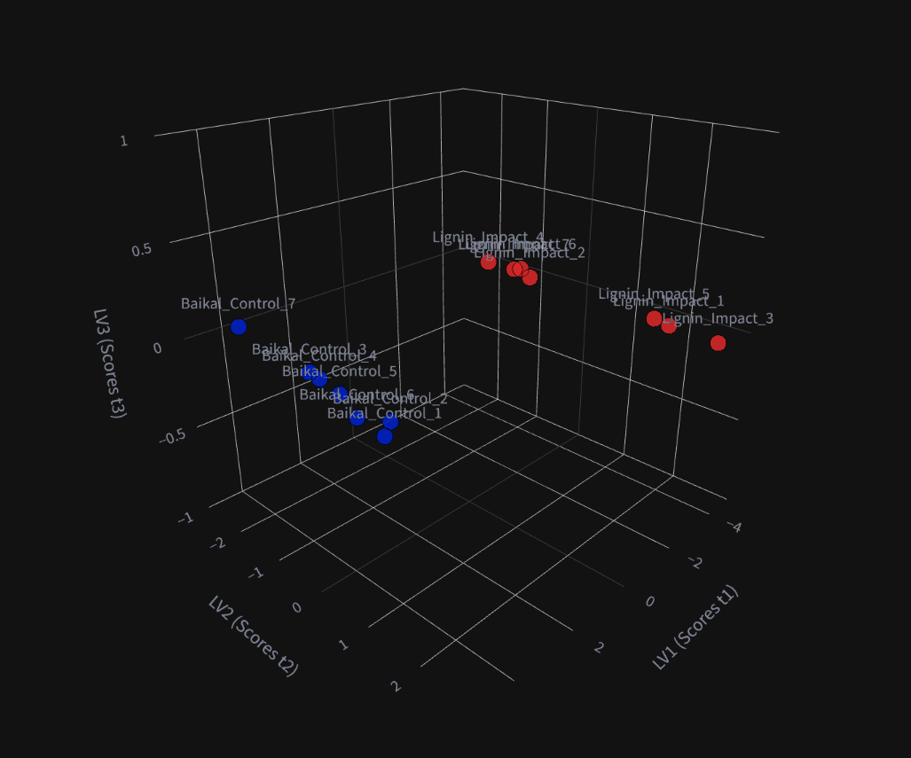

* Интерактивное трехмерное пространство латентных переменных ($LV_1 \times LV_2 \times LV_3$) с аппроксимацией доверительной области распределения многомерных нормальных откликов ($T^2$) и контрастной кластеризацией контрольных проб оз. Байкал и шлам-лигнина БЦБК.

#### Ранжирование ключевых биомаркеров по блокам (VIP Scores Barplot)
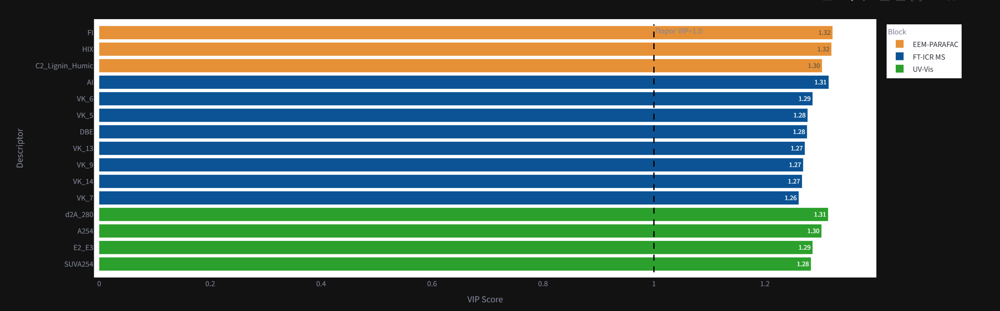

* Многофакторный отбор значимых предикторов с порогом $VIP > 1.0$ и автоматической цветовой дифференциацией по аналитическим источникам (синий — масс-спектрометрия сверхвысокого разрешения FT-ICR MS, оранжевый — флуоресценция EEM-PARAFAC, зеленый — спектрофотометрия UV-Vis).

* **S-Plot диаграмма (OPLS-DA):** визуализация $p[1]$ (ковариация/вклад) vs $p(\text{corr})[1]$ (корреляция/надежность) с цветовой маркировкой аналитических блоков.
* **Валидация и диагностика:** Leave-One-Out / K-Fold кросс-валидация ($Q^2$) и пермутационный тест (50 итераций) с эмпирическим $p$-value.
* **Комплексный аналитический паспорт (.xlsx):** экспорт многостраничного форматированного Excel-отчета с отдельными листами метаданных, сводной матрицы, 20 ячеек FT-ICR MS, EEM-PARAFAC, UV-Vis дескрипторов, VIP-маркеров и S-Plot.
* **Сохранение и восстановление проектов (.chemo):** полная упаковка аналитической сессии (масс-спектры, оптические дескрипторы, сводная матрица, обученные модели) в портативный сжатый файл проекта и восстановление рабочего пространства в один клик.

---

## 📂 Структура проекта

```text
ChemoSuite/
│
├── app.py                            # Главный супер-апп: Streamlit UI-маршрутизация, дашборды трех модальностей и сборщик сессии
│
├── modules/                          # 🧠 Вычислительные и хемометрические модули платформы
│   ├── __init__.py                   # Пакетная инициализация и реэкспорт функций
│   ├── fticr_core.py                 # Ядро масс-спектрометрии: формулы, изотопы 13C, KMD, 20 ячеек, TMDS сети, векторные потоки
│   ├── eem_core.py                   # Оптическое ядро: фильтрация EEM, тензоры PARAFAC, парсер УФ-Вид, IFE, производные, индексы
│   ├── chemo_ml.py                   # Хемометрическое ядро: Low/Mid Fusion, PLS-DA, OPLS-DA, sPLS-DA, 3D Hotelling, S-Plot, пермутация
│   ├── chemo_pubchem.py              # Хемоинформатика: PubChem PUG-REST API, ChEMBL, HMDB, 2D структуры, офлайн-библиотека
│   ├── project_io.py                 # Модуль проектов .chemo: сериализация, ZIP-сжатие и восстановление сессии
│   └── report_generator.py           # Генератор многостраничных Excel-паспортов (.xlsx) на русском и английском с openpyxl
│
├── demo_data/                        # Согласованные мультимодальные демо-данные (EEM, UV-Vis, FT-ICR MS, ML)
│   ├── eem/                          # 12 матриц возбуждения-испускания флуоресценции
│   ├── uv_vis/                       # 12 спектров поглощения УФ-Вид (200–700 нм)
│   ├── fticr_ms/                     # 4 пик-листа масс-спектров высокого разрешения + sample_A_full.csv
│   ├── multimodal_ml/                # Сводные таблицы дескрипторов (поблочные и единая матрица)
│   └── README.md                     # Инструкция по использованию демо-файлов
│
├── tests/                            # Набор модульных тестов pytest (63 unit-теста)
│   ├── test_fticr.py                 # Тесты масс-спектрометрии (формулы, KMD, 20 ячеек, TMDS сети, векторные потоки, пути реакций)
│   ├── test_chemo_pubchem.py         # Тесты хемоинформатики PubChem (PUG-REST, очистка формул, аннотация биомаркеров)
│   ├── test_eem_uv.py                # Тесты оптики (EEM, фильтрация рассеяния, UV-Vis, IFE)
│   ├── test_chemo_ml.py              # Тесты хемометрики (Data Fusion, PLS-DA, OPLS-DA, sPLS-DA, 3D Ellipsoid, S-Plot)
│   ├── test_demo_pipelines.py        # Сквозные интеграционные тесты реальных демо-данных (FT-ICR, EEM, UV-Vis, ML)
│   ├── test_report_generator.py      # Тесты генерации многостраничных Excel-паспортов (.xlsx)
│   ├── test_project_io.py            # Тесты сериализации и восстановления сессий (.chemo)
│   └── test_unusual_stress_cases.py  # Стресс-тестирование граничных и сингулярных условий (сингулярный PLS, пустые спектры, шум)
│
├── .github/workflows/ci.yml          # GitHub Actions CI пайплайн (Ubuntu/Windows, Python 3.10-3.12)
├── pytest.ini                        # Конфигурация запуска тестов pytest
├── assets/                           # Скриншоты и графические материалы для README
├── user_spectra/                     # Локальное хранилище загруженных масс-спектров (в .gitignore)
├── requirements.txt                  # Зависимости проекта (streamlit, tensorly, scikit-learn, openpyxl, pytest)
├── .gitignore                        # Исключения системных и временных файлов
├── README.md                         # Документация платформы (русский)
└── README_EN.md                      # Документация платформы (английский)
```

---

## 🚀 Быстрый старт

### 1. Клонирование репозитория
```bash
git clone https://github.com/xav1c34/ChemoSuite.git
cd ChemoSuite
```

### 2. Настройка виртуального окружения
**Windows (PowerShell):**
```powershell
python -m venv .venv
.venv\Scripts\Activate.ps1
```

**Linux / macOS:**
```bash
python3 -m venv .venv
source .venv/bin/activate
```

### 3. Установка библиотек
```bash
pip install --upgrade pip
pip install -r requirements.txt
```

### 4. Запуск автоматических тестов
```bash
pytest -v tests
```

### 5. Запуск веб-приложения
```bash
streamlit run app.py
```

После запуска интерфейс автоматически откроется в браузере по адресу: `http://localhost:8501`.

---

## 📦 Форматы входных данных

* **Масс-спектрометрия (FT-ICR MS):** текстовые файлы списков пиков (`.csv`, `.tsv`, `.txt`, `.xy`). Требуется минимум две числовые колонки: экспериментальная масса ($m/z$) и интенсивность/высота пика.
* **Флуориметрия (EEM):** 2D-таблицы матриц флуоресценции (`.csv`, `.dat`, `.txt`), где строки соответствуют длинам волн эмиссии ($Em$), а столбцы — возбуждения ($Ex$) (либо наоборот; парсер определяет ориентацию автоматически).
* **Спектрофотометрия (UV-Vis):** 1D-таблицы спектров поглощения (`.csv`, `.txt`, `.tsv`) с колонками длины волны ($\lambda$, 200–800 нм) и оптической плотности ($A$).

---

## 🏷️ История версий

* **`v1.0.0-fticr`**: Автономная версия студии масс-спектрометрии сверхвысокого разрешения NOM-SPECTRa.
* **`v2.0.0`**: Интеграция 3D спектрофлуориметрии EEM-PARAFAC, модуля мультиблочного объединения дескрипторов (Data Fusion) и дискриминантного анализа PLS-DA.
* **`v2.1.0` (ChemoSuite Trimodal)**:
  * Полноценная трехмодальная интеграция: **FT-ICR MS + EEM-PARAFAC + UV-Vis**.
  * Модуль УФ-Вид спектрофотометрии: расчет $A_{254}, A_{280}, E_2/E_3, S_R$, оценка $M_w$ по Перминовой, производная спектроскопия ($d^2A_{280}$), коррекция внутреннего фильтра (IFE).
  * Продвинутые стратегии слияния: Low-Level (блочный скейлинг $1/\sqrt{P}$) и Mid-Level Fusion (PCA сжатие FT-ICR MS).
  * Диагностика и валидация PLS-DA: пермутационный тест с $p$-value, матрица ошибок, чувствительность/специфичность, расчет процентного веса аналитических блоков ($\text{VIP}^2$).
  * Сборщик сессии: автоматическое сведение дескрипторов из Модулей 1 и 2 в Модуль 3.
  * Модульная архитектура: разделение вычислительных ядер (`fticr_core.py`, `eem_core.py`, `chemo_ml.py`) и UI (`app.py`).
  * Полный набор из 18 unit-тестов (`pytest`) и автоматический CI/CD пайплайн GitHub Actions.
* **`v2.2.0` (ChemoSuite LTS / Full Trimodal & Chemoinformatics Release)**:
  * Алгоритмы ортогонального OPLS-DA и разреженного sPLS-DA ($L_1$-LASSO регуляризация с отбором ключевых биомаркеров).
  * Расширенная хемоинформатика: прямое отображение 2D-структур и кросс-поиск в базах данных PubChem, ChEMBL и HMDB.
  * Полная двуязычная локализация i18n (RU/EN) во всех модулях, вкладках, графиках и отчетах.
  * Экспорт паспортов в многостраничный Excel (.xlsx) с форматированием openpyxl и двуязычной поддержкой.
  * Управление проектами (`.chemo` архивы сессий) с полной сериализацией состояния и 1-кликовым восстановлением.
  * Полный стресс-тестовый пакет из 63 unit/интеграционных тестов (включая проверку сингулярностей, нулевых дисперсий и поврежденных данных).
  * Модернизация Streamlit API под актуальные стандарты (`width="stretch"`).

---

## 👥 Авторство и разработка

Алгоритмы, расчетные ядра и программный комплекс платформы разработаны:

* **Т. О. Бай** (Bay, T. O., 2026 г.) — концепция, архитектура, вычислительные ядра и веб-интерфейс платформы

---

## 📜 Цитирование / Citation

Если вы используете платформу **ChemoSuite** в научной работе или экологических исследованиях, пожалуйста, укажите ссылку на репозиторий и процитируйте программный комплекс:

```bibtex
@software{chemosuite2026,
  author       = {Bay, T. O.},
  title        = {{ChemoSuite: Multimodal Chemometrics Platform for Natural Organic Matter and Lignin Analysis}},
  year         = {2026},
  publisher    = {GitHub},
  version      = {v2.2.0},
  url          = {https://github.com/xav1c34/ChemoSuite},
  note         = {Web Application: https://nom-spectra.streamlit.app/}
}
```